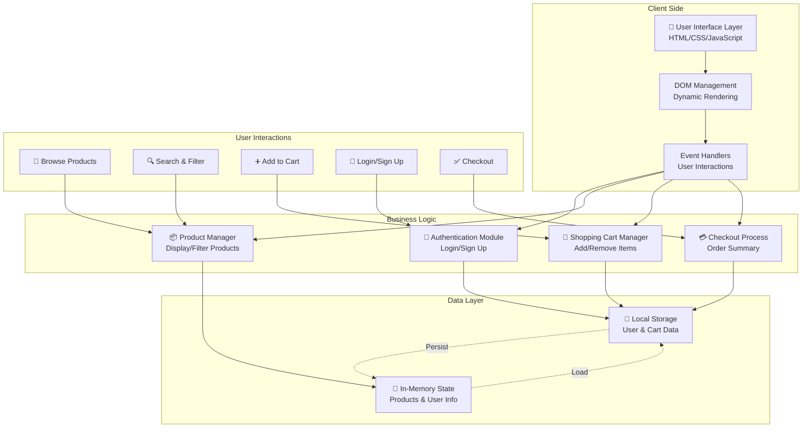
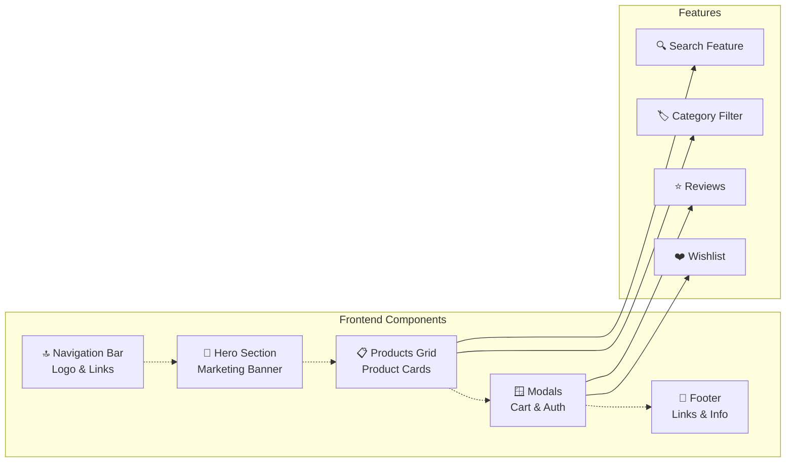
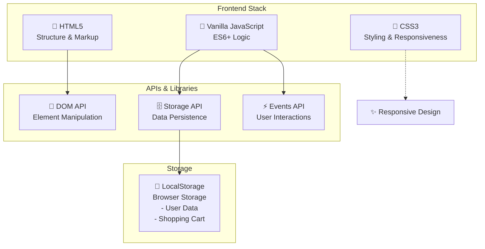

## E-Commerce Store Architecture Overview

This document outlines the architecture of the EcoShop e-commerce platform, a client-side web application built with vanilla HTML, CSS, and JavaScript.

### System Architecture Diagram

### Component Architecture Diagram

### Technology Stack

### Key Features & Modules

| Feature | Module | Functionality |
|---------|--------|---------------|
| **Product Display** | displayProducts() | Render product grid dynamically |
| **Search & Filter** | filterProducts() | Filter by name and category |
| **Authentication** | handleLogin()/handleSignUp() | User login and registration |
| **Shopping Cart** | addToCart()/removeFromCart() | Manage cart items |
| **Persistence** | saveCartToLocalStorage() | Save user data locally |
| **Checkout** | checkout() | Process order and summary |

### Security Notes

⚠️ **This is a demo/prototype application**

For production use, implement:
- Backend authentication and validation
- Secure password hashing
- HTTPS encryption
- Payment gateway integration
- Rate limiting and CSRF protection